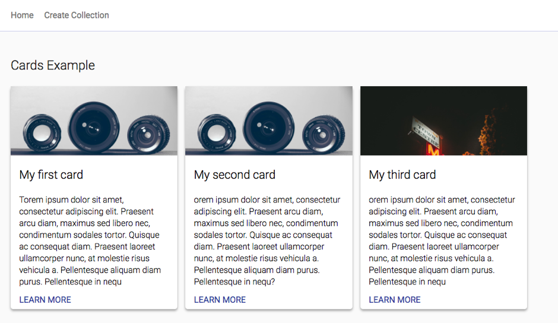
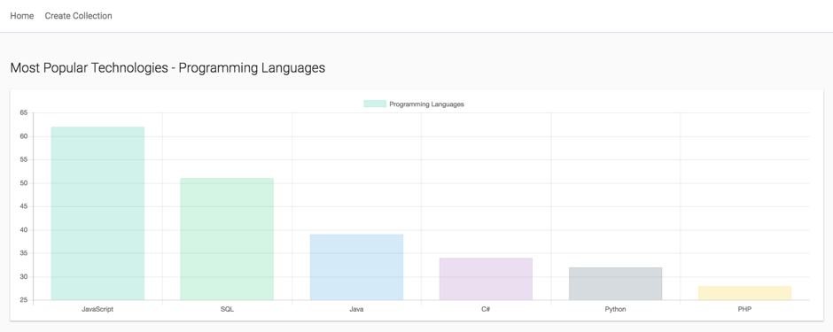
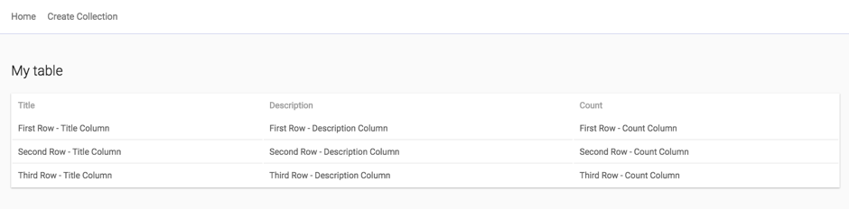

# My Dashboard

# Preview

# Setup
1. yarn install
2. yarn start

More info at: [Installation instructions](https://github.com/MaartenGDev/mydashboard/wiki/Installation)

# Documentation
[Basic Setup](https://github.com/MaartenGDev/mydashboard/wiki/Basic-Setup)

## Stack
- NodeJS
- Express
- Mysql
- ReactJs
- Redux
- Sass

## Example Collections

### Cards

### Charts

### Table

